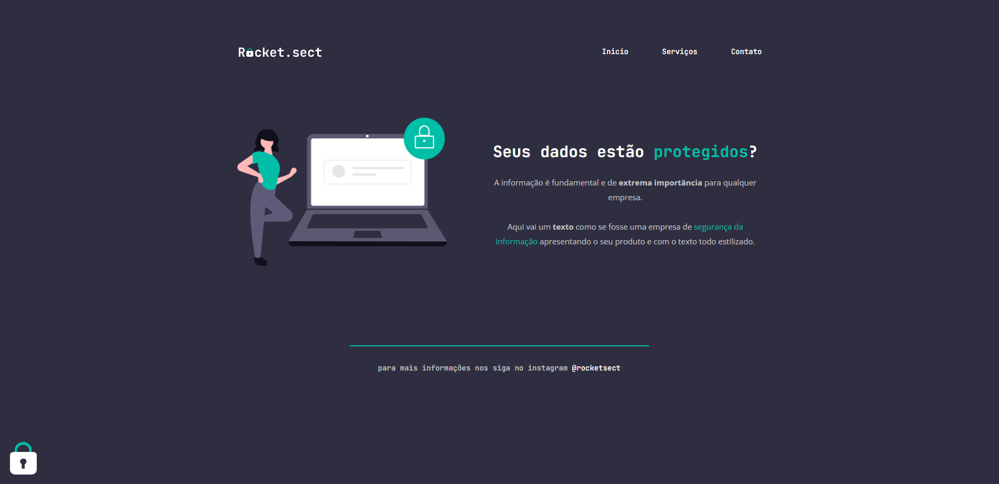

<h1 align="center">Desafio 2 recriando layout explorer
</h1>

## 🚀 Tecnologias

Esse projeto foi desenvolvido com as seguintes tecnologias:

- HTML
- CSS

## PRINCIPAL APRENDIZADO
novas interfaces e ideias de estilização

## sobre
projeto desenvolvido no explorer da rocketseat

## 💻 Projeto Fotos

 

